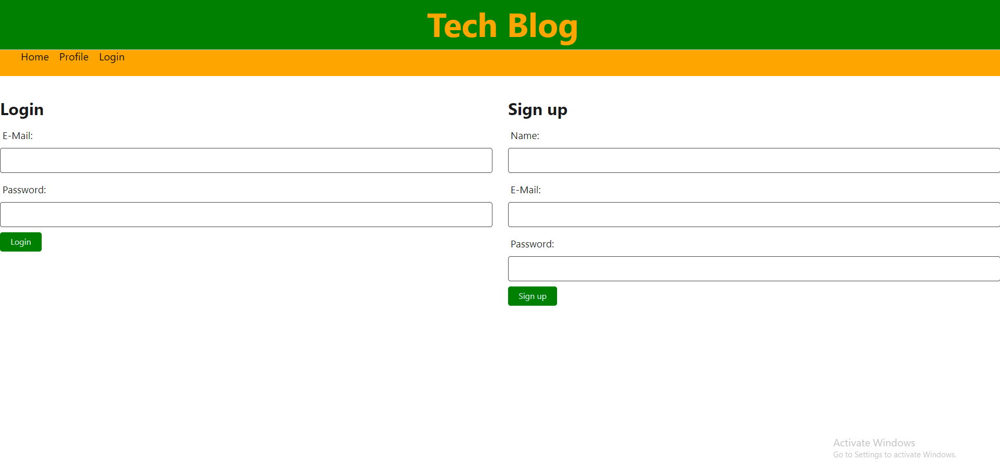
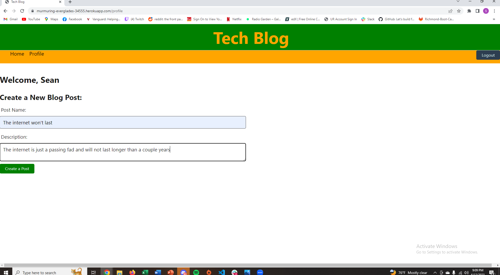
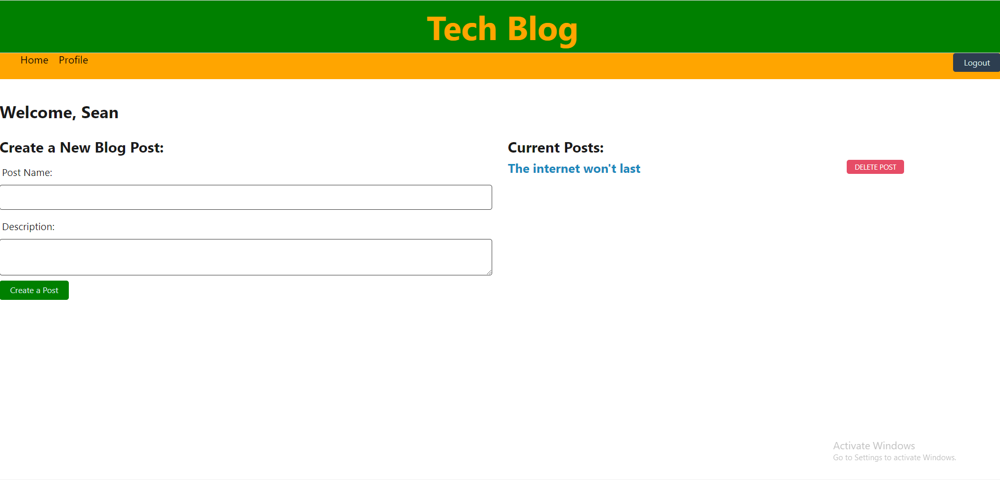
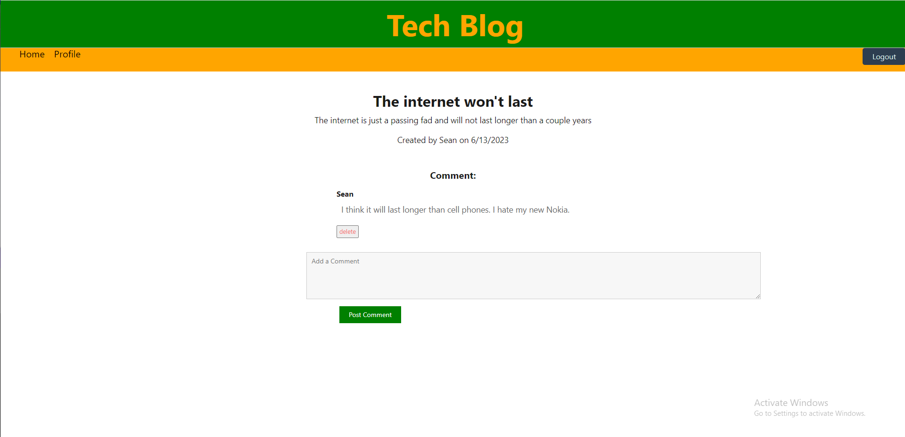

# tech-blog

## Description

In this project, I was tasked with creating a tech blog webpage. It has login and sign up functionality, users can add posts, and users can comment on those posts. All posts are displayed upon opening the webpage and are clickable after logging in. This was a full stack project so both the front end and back end were built from scratch.

## License

MIT License

## Installation

The application is deployed on Heroku. No installation required

## Usage

Create a profile with the sign up functionality, click on create a post and type what ever thoughts come to mind.

## Screenshots

## Link to Webpage

https://murmuring-everglades-34555.herokuapp.com/